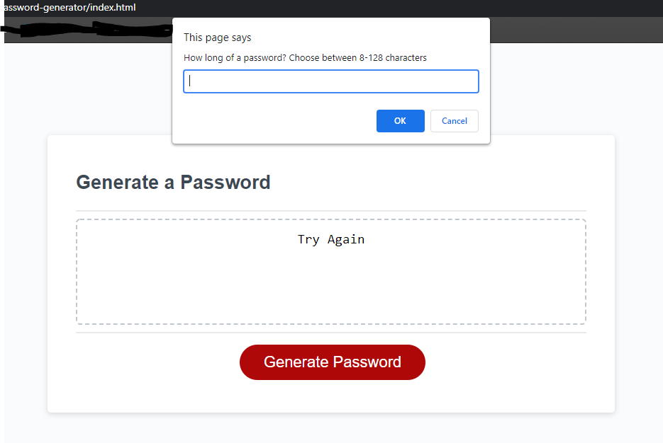

# Random Password Generator
> Homework Assignment #3

This is a random password generator. When you click the "Generate Password" button a series of prompts pop up. These prompts are for selecting the criteria of the random password. Once complete a random password is generated.

## Features

The password is generated depending on 4 criteria:
* Character length between 8 and 128
* including lowercase letters
* including UPPERCASE letters
* including numbers
* including special characters 

